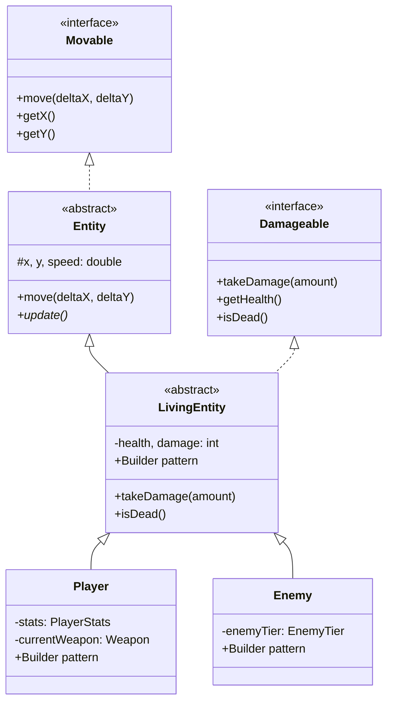

# Java Survivors Prototype - Design Document

A Vampire Survivors / Megabonk-inspired roguelike game built in Java to practice OOP concepts.

## MVP Scope

| Feature | Status | Notes |
|---------|--------|-------|
| Player movement + collision | 📋 Planned | Core gameplay |
| Single enemy type (D-tier) | 📋 Planned | Expandable later |
| Melee weapon only (Sword) | 📋 Planned | Abstract hierarchy ready for more |
| Level-up with RNG rolls | 📋 Planned | Stat boosts, new weapons (max 3) |
| Stat boost items | 📋 Planned | Flat bonuses, multiplier system |
| 5 waves with scaling | 📋 Planned | Density + speed increase |
| Core stats system | ✅ Done | damage, atk speed, cooldown, luck |

---

## Architecture Design

### Package Structure

```
survivor-game/
├── src/
│   ├── entities/
│   │   ├── Movable.java       # Interface ✅
│   │   ├── Damageable.java    # Interface ✅
│   │   ├── Entity.java        # Abstract base ✅
│   │   ├── LivingEntity.java  # Abstract + Builder ✅
│   │   ├── EnemyTier.java     # Enum ✅
│   │   ├── PlayerStats.java   # Stat multipliers ✅
│   │   ├── Player.java        # + Builder ✅
│   │   └── Enemy.java         # + Builder ✅
│   └── weapons/
│       └── Weapon.java        # Abstract (stub)
└── README.md
```

---

### Core Interfaces

```java
interface Movable {
    void move(double deltaX, double deltaY);
    double getX();
    double getY();
}

interface Damageable {
    void takeDamage(int amount);
    int getHealth();
    boolean isDead();
}
```

---

### Entity Hierarchy



---

### Builder Pattern

Using self-referential generic builders to avoid constructor overload.

```java
Player p = new Player.Builder()
    .x(100).y(50)
    .health(150)
    .stats(new PlayerStats())
    .build();

Enemy e = new Enemy.Builder()
    .x(0).y(0)
    .enemyTier(EnemyTier.D)
    .build();
```

---

### Stats System

**Approach:** Flat bonuses + Multipliers (applied in order).

**Damage Calculation:**
```
Final Damage = (Weapon.baseDamage + Player.flatDamage) × Player.damageMultiplier
```

---

### Rendering Strategy

**Decision:** LibGDX with `ShapeRenderer` (colored rectangles)

**Approach:**
- No sprites/textures needed—entities are **colored squares**
- Player = Blue, Enemies = Red (tier-based shades), Projectiles = Yellow
- LibGDX provides game loop with delta time out of the box

**Color Scheme:**
| Entity | Color |
|--------|-------|
| Player | `Color.BLUE` |
| D-tier Enemy | `Color.RED` |
| C-tier Enemy | `Color.ORANGE` |
| Weapon/Projectile | `Color.YELLOW` |

**Minimal Render Example:**
```java
shapeRenderer.begin(ShapeType.Filled);
shapeRenderer.setColor(Color.BLUE);
shapeRenderer.rect((float)player.getX(), (float)player.getY(), 32, 32);
for (Enemy e : enemies) {
    shapeRenderer.setColor(e.getTier().getColor());
    shapeRenderer.rect((float)e.getX(), (float)e.getY(), 24, 24);
}
shapeRenderer.end();
```

**Package Structure:**
```
src/
├── entities/        # Backend logic (rendering-agnostic) ✅
├── weapons/         # Backend logic
├── core/            # LibGDX game class, screen management
└── rendering/       # ShapeRenderer wrapper
```
