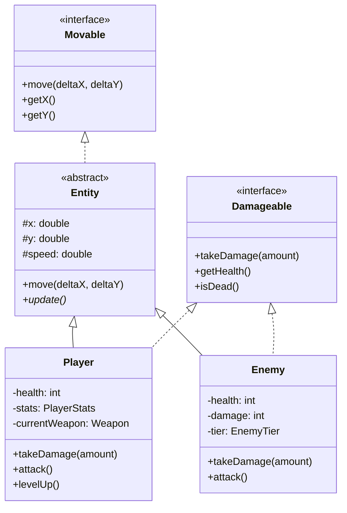
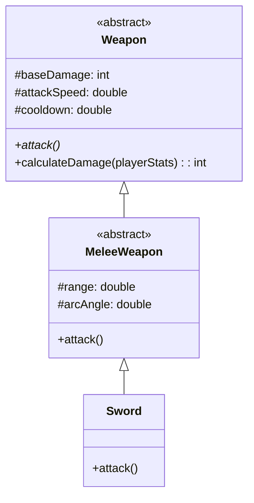

# Java Survivors Prototype - Design Document

A Vampire Survivors / Megabonk-inspired roguelike game built in Java to practice OOP concepts.

## MVP Scope

| Feature | Status | Notes |
|---------|--------|-------|
| Player movement + collision | 📋 Planned | Core gameplay |
| Single enemy type (D-tier) | 📋 Planned | Expandable later |
| Melee weapon only (Sword) | 📋 Planned | Abstract hierarchy ready for more |
| Level-up with RNG rolls | 📋 Planned | Stat boosts, new weapons (max 3) |
| Stat boost items | 📋 Planned | Flat bonuses, multiplier system |
| 5 waves with scaling | 📋 Planned | Density + speed increase |
| Core stats system | 📋 Planned | damage, atk speed, cooldown, luck |

**Deferred to post-MVP:**
- Effect items (lightning, periodic damage)
- Ranged/Magic weapon classes
- Higher tier enemies (B, A, S)

---

## Architecture Design

### Package Structure

```
survivor-game/
├── src/
│   ├── game/
│   │   └── Game.java          # Main loop, game state
│   ├── entities/
│   │   ├── Movable.java       # Interface
│   │   ├── Damageable.java    # Interface  
│   │   ├── Entity.java        # Abstract base
│   │   ├── PlayerStats.java   # Player stat multipliers
│   │   ├── Player.java
│   │   ├── Enemy.java
│   │   └── Projectile.java    # For future ranged weapons
│   ├── weapons/
│   │   ├── Weapon.java        # Abstract
│   │   ├── MeleeWeapon.java   # Abstract
│   │   └── Sword.java         # Concrete MVP weapon
│   ├── items/
│   │   └── Item.java          # Stat boost items
│   └── systems/
│       ├── WaveManager.java   # Wave spawning/scaling
│       └── StatsManager.java  # Player stats calculation
└── README.md
```

---

### Core Interfaces

```java
// Movable.java
interface Movable {
    void move(double deltaX, double deltaY);
    double getX();
    double getY();
}

// Damageable.java  
interface Damageable {
    void takeDamage(int amount);
    int getHealth();
    boolean isDead();
}
```

---

### Entity Hierarchy



---

### Weapon Hierarchy



**Design Decision:** Weapons are abstract because you never instantiate "a weapon" — you instantiate a Sword, Katana, etc. This follows OOP best practices.

---

### Stats System

**Approach:** Flat bonuses + Multipliers (applied in order).

```java
class PlayerStats {
    // Flat bonuses (added to base)
    public int flatDamage = 0;
    public int flatHealth = 0;
    
    // Multipliers (applied after flat bonuses)
    public double damageMultiplier = 1.0;
    public double attackSpeedMultiplier = 1.0;
    public double cooldownMultiplier = 1.0;
    public double luckMultiplier = 1.0;
    
    // Base values
    public int maxHealth = 100;
    public double moveSpeed = 5.0;
}
```

**Damage Calculation:**
```
Final Damage = (Weapon.baseDamage + Player.flatDamage) × Player.damageMultiplier
```

**Item Examples:**
```java
// "+2 damage" item (flat):
playerStats.flatDamage += 2;

// "+10% damage" item (multiplier):
playerStats.damageMultiplier += 0.1;
```

---

## Development Approach

> **Guided Learning:** This project is a self-quiz. The user writes all code; this document serves as the blueprint and reference.

### Phase 1 Deliverables (User implements)
1. Create folder structure
2. Write `Movable.java` interface
3. Write `Damageable.java` interface
4. Write `Entity.java` abstract class
5. Write `Player.java` extending Entity, implementing Damageable

---

## Verification Plan

### Manual Testing (User-driven)
Since this is a learning exercise, verification is done by:

1. **Compile check:** `javac` should compile all files without errors
2. **Unit behavior:** User writes a simple `Main.java` to test:
   - Create a Player, move it, verify position changes
   - Call `takeDamage()`, verify health decreases
   - Verify `isDead()` returns true when health ≤ 0

### Future Automated Tests
Once core classes exist, consider adding JUnit tests for:
- Damage calculations
- Stat multiplier stacking
- Wave scaling logic
